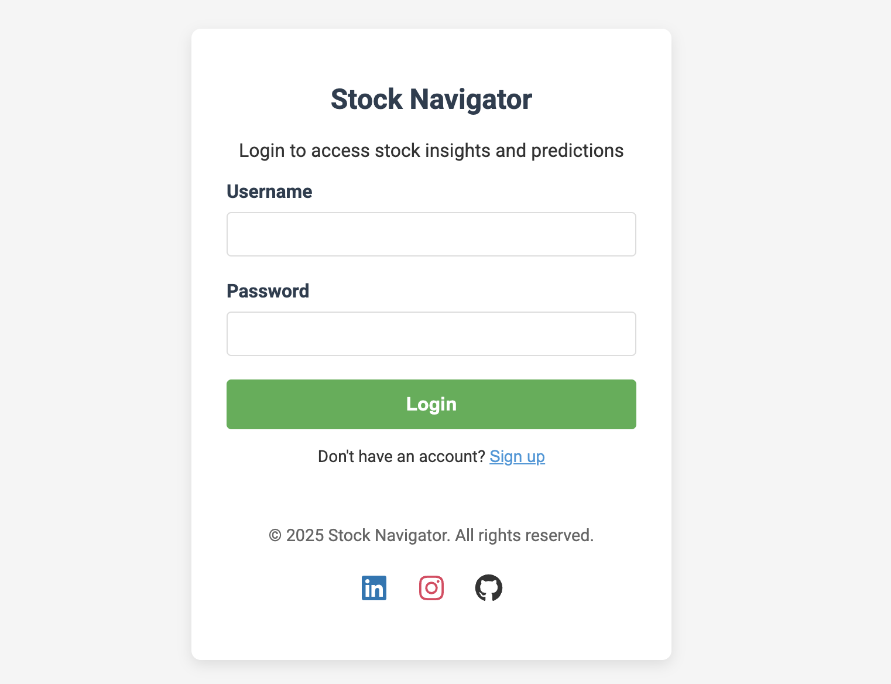
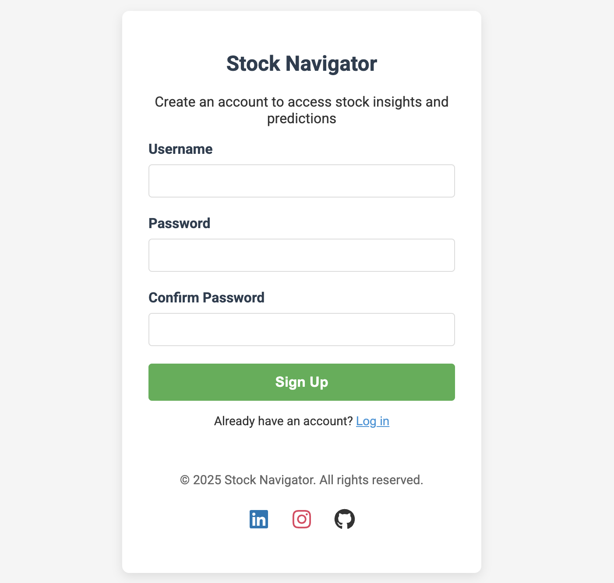
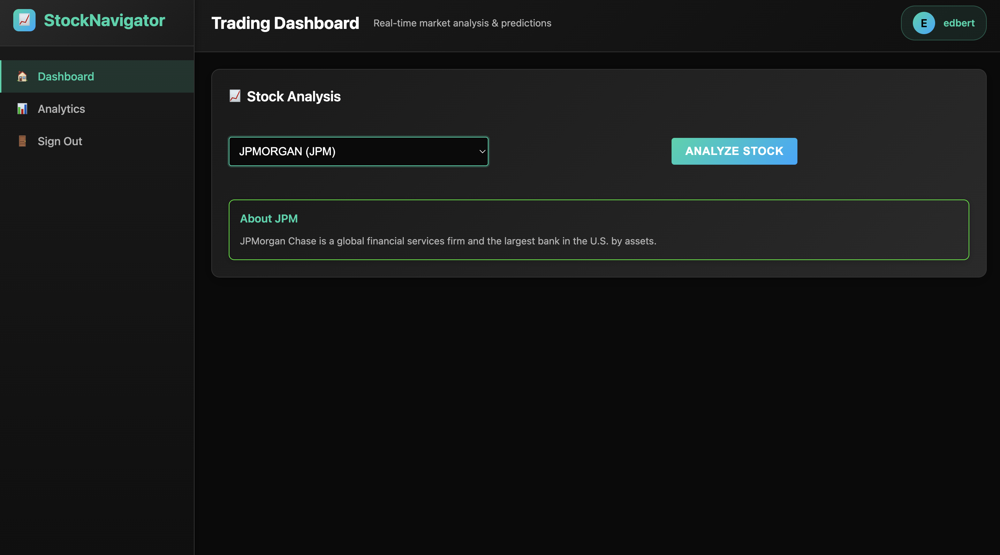
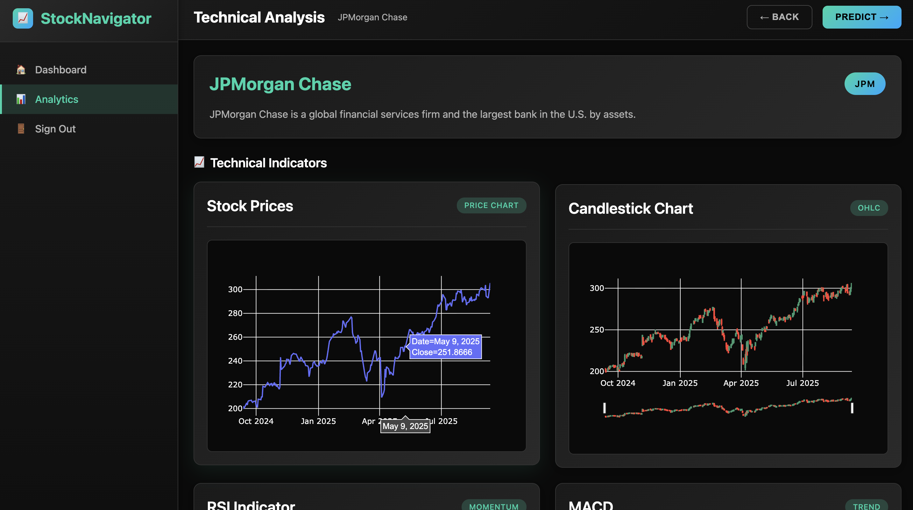
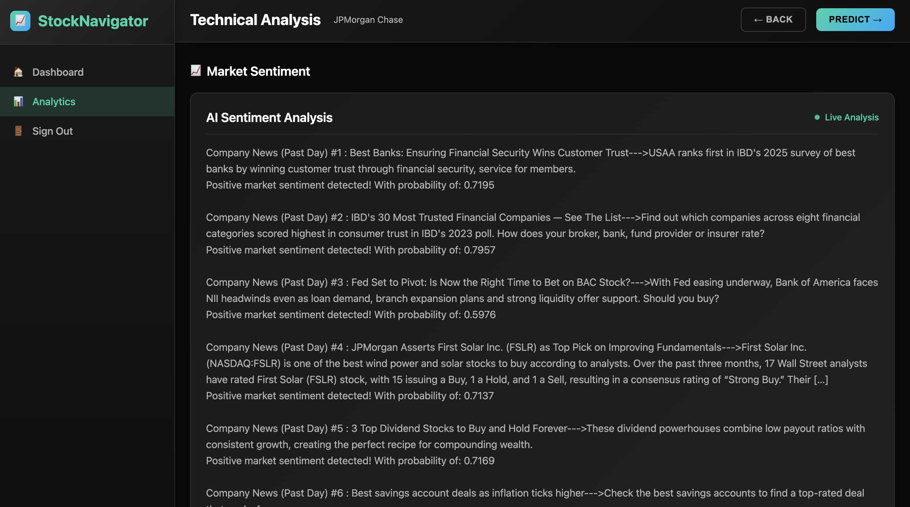
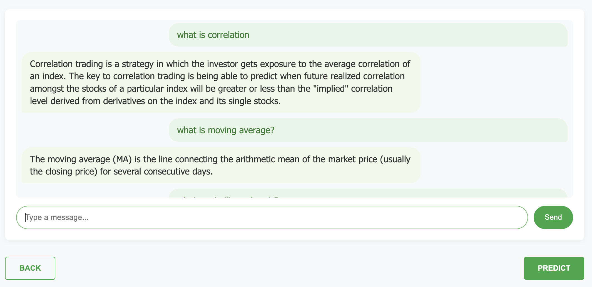
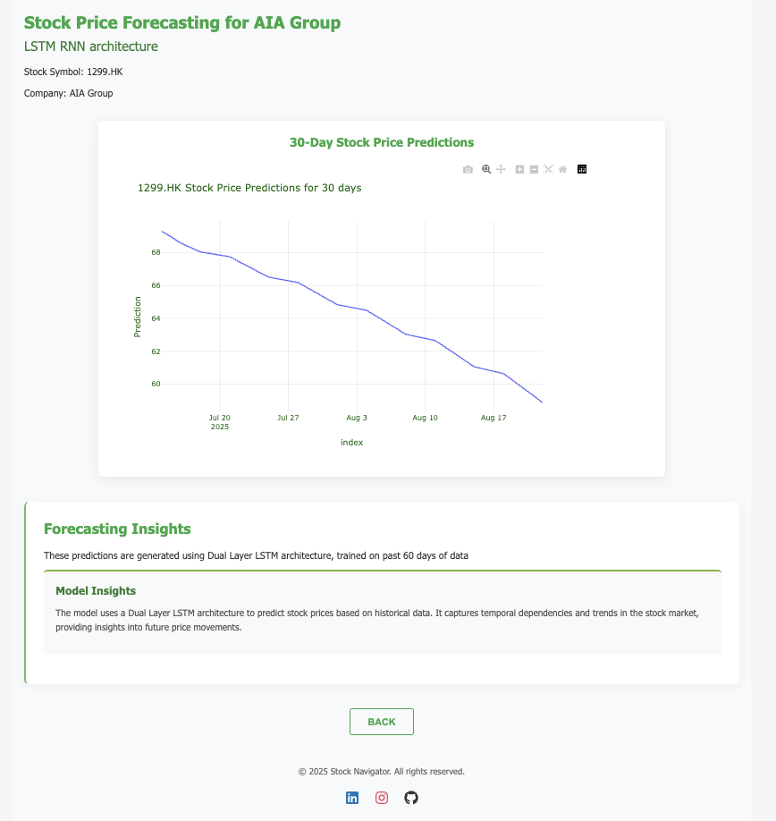

# 🚀 Stock-Navigator

> **Your One-Stop Full-Stack Stock Market Discovery Platform**

---
### Login Page


---

### Signup Page


---
### Home Page


---
### Dynamic Real-Time Stock Analytics and Dashboard


---
### Real-Time Market News and Sentiment Analysis


---
### Advanced AI-Powered Chatbot


---
### Predictive Analytics


---

## 🧐 What is Stock-Navigator?

**Stock-Navigator** is the all-in-one, containerized web application built for stock market enthusiasts, analysts, and curious investors. Dive deep into your favorite stocks with:

- 🔐 **Security & Data Privacy**: User authentication through username and passwords stored from our PostgreSQL database
- 📈 **Comprehensive data**: From basic info to advanced statistical metrics.
- 🧠 **AI-powered insights**: Ask our integrated RAG + Fine-tuned AI anything—answers are fetched from a rich, web-scraped knowledge base.
- 🖼️ **Real-time Market Sentiment Analysis**: Read real-time market news on the company and use our system to analyze its sentiment.
- 🔮 **Stock price prediction**: Interactive, LSTM-driven predictions with beautiful charting.
- 🛠️ **Modern full-stack experience**: Fast, intuitive, and ready for your contributions!

---

## 🚦 Quick Start Guide

### 🐍 **Run Locally**

1. **Activate virtual environment**:
    ```bash
    source .venv/bin/activate
    ```
2. **Install dependencies:**
    ```bash
    pip3 install -r requirements.txt
    ```
3. **Initialize a PostgreSQL database connection through Docker or 3-rd party apps**

4. **Navigate to backend and launch the server:**
    ```bash
    cd server
    python manage.py runserver
    ```
    > _No need to run a separate frontend server—everything is rendered for you!_

---

### 🐳 **Run with Docker**

1. **Build the Docker image:**
    ```bash
    docker build -t stocknavigator .
    ```
2. **Spin up the container:**
    ```bash
    docker run -p 8000:8000 stocknavigator
    ```

---

## 💹 Supported Stocks

Currently, Stock-Navigator brings you insights on 64 S&P500 and HK corporations:

| #  | Ticker   | Company Name                 |
|----|----------|------------------------------|
| 1  | NVDA     | NVIDIA                       |
| 2  | HSBC     | HSBC                         |
| 3  | NDAQ     | NASDAQ                       |
| 4  | TSLA     | Tesla                        |
| 5  | JPM      | JPMorgan Chase               |
| 6  | MS       | Morgan Stanley               |
| 7  | AAPL     | Apple                        |
| 8  | GOOGL    | Google (Alphabet)            |
| 9  | AMZN     | Amazon                       |
| 10 | META     | Meta                         |
| 11 | MSFT     | Microsoft                    |
| 12 | NFLX     | Netflix                      |
| 13 | DIS      | Disney                       |
| 14 | GS       | Goldman Sachs                |
| 15 | JEF      | Jefferies                    |
| 16 | C        | Citigroup                    |
| 17 | V        | Visa                         |
| 18 | BLK      | BlackRock                    |
| 19 | IBM      | IBM                          |
| 20 | UBER     | Uber                         |
| 21 | ORCL     | Oracle                       |
| 22 | WMT      | Walmart                      |
| 23 | MA       | Mastercard                   |
| 24 | XOM      | ExxonMobil                   |
| 25 | COST     | Costco                       |
| 26 | BAC      | Bank of America              |
| 27 | PLTR     | Palantir                     |
| 28 | KO       | Coca-Cola                    |
| 29 | PEP      | PepsiCo                      |
| 30 | UNH      | UnitedHealth Group           |
| 31 | CRM      | Salesforce                   |
| 32 | MCD      | McDonald's                   |
| 33 | ACN      | Accenture                    |
| 34 | BA       | Boeing                       |
| 35 | ABNB     | Airbnb                       |
| 36 | AON      | Aon                          |
| 37 | DASH     | DoorDash                     |
| 38 | INTC     | Intel                        |
| 39 | ZM       | Zoom                         |
| 40 | SBUX     | Starbucks                    |
| 41 | NKE      | Nike                         |
| 42 | CB       | Chubb                        |
| 43 | CRWD     | CrowdStrike                  |
| 44 | BX       | Blackstone                   |
| 45 | MFC      | Manulife                     |
| 46 | 1299.HK  | AIA Group (Hong Kong)        |
| 47 | 0388.HK  | HKEX (Hong Kong Exchange)    |
| 48 | 0700.HK  | Tencent (Hong Kong)          |
| 49 | 2318.HK  | Ping An Insurance (Hong Kong)|
| 50 | 0939.HK  | China Construction Bank      |
| 51 | 0005.HK  | HSBC Holdings (Hong Kong)    |
| 52 | 0001.HK  | CK Hutchison Holdings        |
| 53 | 0002.HK  | CLP Holdings                 |
| 54 | 0011.HK  | MTR Corporation              |
| 55 | 3988.HK  | Bank of China (Hong Kong)    |
| 56 | 0003.HK  | Hang Seng Bank               |
| 57 | 9888.HK  | Baidu                        |
| 58 | 9988.HK  | Alibaba Group                |
| 59 | 9618.HK  | Meituan                      |
| 60 | 8147.HK  | Millennium Pacific Group     |
| 61 | 1828.HK  | FWD Group                    |
| 62 | 2628.HK  | China Life Insurance         |
| 63 | 0966.HK  | China Taiping Insurance      |
| 64 | 1508.HK  | China Reinsurance Group      |


---

## 🏗️ Key Technologies

Stock-Navigator is powered by an exciting tech stack:

- **Frontend:** React.js, HTML, CSS, Plotly.js
- **Backend:** Django, Django REST Framework
- **Data Science:** Pandas, NumPy, TensorFlow, PyTorch, Yahoo Finance, FinnHub, Torch Script
- **AI/ML:** LangChain, HuggingFace, Transformers, LSTM, FAISS Vector DB, Seq2seq Trainers
- **Scraping:** BeautifulSoup
- **DevOps:** Docker
- **Databases:** PostgreSQL, Redis
- **Security:** JWT Tokens
- **CI/CD Integration:** GitHub Actions

---

## 🤖 Features You’ll Love

- **Interactive Stock Dashboard:** Get real-time data and visualize market trends.
- **AI Chat Assistant:** Ask any stock question—get context-rich, AI-generated answers with persistent chat history.
- **Predictive Analytics:** Forecast prices using advanced RNN (LSTM) models, cache results with Redis for speed and efficiency
- **Curated Knowledge Base:** Answers are RAG-powered and sourced from the latest market info.
- **Market Sentiment Analysis** Retrieve real-time market news on the company and analyse underlying sentiment
---

## 🌱 Contributing

We’re always open to **improvements, suggestions, and collaborations!**

- Fork the repo
- Create your feature branch (`git checkout -b amazing-feature`)
- Commit your changes (`git commit -m 'Add awesome feature'`)
- Push to the branch (`git push origin amazing-feature`)
- Open a Pull Request

Let’s make Stock-Navigator the go-to platform for all things stocks!

---

## 📫 Contact

Questions? Suggestions? Want to collaborate?  
Open an issue or pull request, or reach out to the maintainer directly!

---

