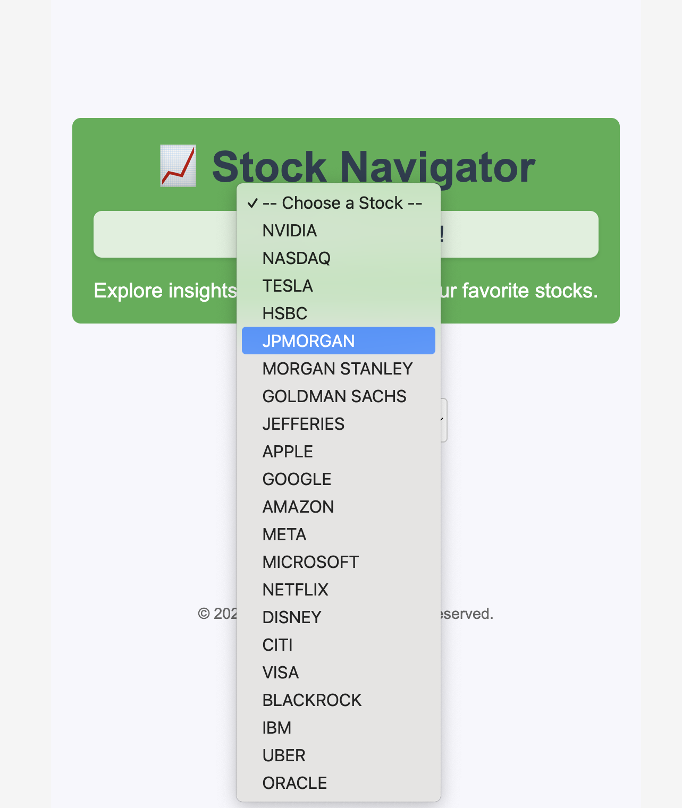

# 🚀 Stock-Navigator

> **Your One-Stop Full-Stack Stock Market Discovery Platform**

---
### Login Page


---

### Signup Page


---
### Home Page


---
### Dynamic Real-Time Stock Analytics and Dashboard


---
### Real-Time Market News and Sentiment Analysis


---
### Advanced AI-Powered Chatbot


---
### Predictive Analytics


---

## 🧐 What is Stock-Navigator?

**Stock-Navigator** is the all-in-one, containerized web application built for stock market enthusiasts, analysts, and curious investors. Dive deep into your favorite stocks with:

- 🔐 **Security & Data Privacy**: User authentication through username and passwords stored from our PostgreSQL database
- 📈 **Comprehensive data**: From basic info to advanced statistical metrics.
- 🧠 **AI-powered insights**: Ask our integrated RAG + Fine-tuned AI anything—answers are fetched from a rich, web-scraped knowledge base.
- 🖼️ **Real-time Market Sentiment Analysis**: Read real-time market news on the company and use our system to analyze its sentiment.
- 🔮 **Stock price prediction**: Interactive, LSTM-driven predictions with beautiful charting.
- 🛠️ **Modern full-stack experience**: Fast, intuitive, and ready for your contributions!

---

## 🚦 Quick Start Guide

### 🐍 **Run Locally**

1. **Activate virtual environment**:
    ```bash
    source .venv/bin/activate
    ```
2. **Install dependencies:**
    ```bash
    pip3 install -r requirements.txt
    ```
3. **Initialize a PostgreSQL database connection through Docker or 3-rd party apps**

4. **Navigate to backend and launch the server:**
    ```bash
    cd server
    python manage.py runserver
    ```
    > _No need to run a separate frontend server—everything is rendered for you!_

---

### 🐳 **Run with Docker**

1. **Build the Docker image:**
    ```bash
    docker build -t stocknavigator .
    ```
2. **Spin up the container:**
    ```bash
    docker run -p 8000:8000 stocknavigator
    ```

---

## 💹 Supported Stocks

Currently, Stock-Navigator brings you insights on 21 S&P500 corporations:

| #  | Company  |
|----|----------|
| 1  | NVIDIA   |
| 2  | HSBC     |
| 3  | NASDAQ   |
| 4  | TESLA    |
| 5  | JPMORGAN |
| 6  | MORGAN S |
| 7  | APPLE    |
| 8  | GOOGLE   |
| 9  | AMAZON   |
| 10 | META     |
| 11 | MICROSOFT|
| 12 | NETFLIX  |
| 13 | DISNEY   |
| 14 | GOLDMAN S|
| 15 | JEFFERIES|
| 16 | CITI     |
| 17 | VISA     |
| 18 | BLACKROCK|
| 19 | IBM      |
| 20 | UBER     |
| 21 | ORACLE   |


---

## 🏗️ Key Technologies

Stock-Navigator is powered by an exciting tech stack:

- **Frontend:** React.js, HTML, CSS, Plotly.js
- **Backend:** Django, Django REST Framework
- **Data Science:** Pandas, NumPy, TensorFlow, PyTorch, Yahoo Finance, FinnHub, Torch Script
- **AI/ML:** LangChain, HuggingFace, Transformers, LSTM, FAISS Vector DB, Seq2seq Trainers
- **Scraping:** BeautifulSoup
- **DevOps:** Docker
- **Databases:** PostgreSQL
- **Security:** JWT Tokens
- **CI/CD Integration:** GitHub Actions

---

## 🤖 Features You’ll Love

- **Interactive Stock Dashboard:** Get real-time data and visualize market trends.
- **AI Chat Assistant:** Ask any stock question—get context-rich, AI-generated answers.
- **Predictive Analytics:** Forecast prices using advanced RNN (LSTM) models.
- **Curated Knowledge Base:** Answers are RAG-powered and sourced from the latest market info.
- **Market Sentiment Analysis** Retrieve real-time market news on the company and analyse underlying sentiment
---

## 🌱 Contributing

We’re always open to **improvements, suggestions, and collaborations!**

- Fork the repo
- Create your feature branch (`git checkout -b amazing-feature`)
- Commit your changes (`git commit -m 'Add awesome feature'`)
- Push to the branch (`git push origin amazing-feature`)
- Open a Pull Request

Let’s make Stock-Navigator the go-to platform for all things stocks!

---

## 📫 Contact

Questions? Suggestions? Want to collaborate?  
Open an issue or pull request, or reach out to the maintainer directly!

---

